# Trend Intelligence Brain — System Specification

## Problem Statement

The user is responsible for producing recurring intelligence and newsletter content covering marketing, Gen Z, cultural and consumer trends, social trends, technology, and related topics. The work increasingly requires retrieving relevant information from a growing set of external sources and turning that information into timely insights.

Today, this type of work can become repetitive and difficult to scale because information retrieval, web scraping, source monitoring, normalization, deduplication, research, analysis, and summarization are all mixed together. It is also difficult to build durable institutional knowledge when the output is treated as a one-off weekly newsletter rather than as a continuously growing historical dataset.

The desired system is therefore not merely a news aggregator or a newsletter generator. It is a **Trend Intelligence Brain**: a persistent data and knowledge platform that continuously collects information from a curated set of sources, preserves historical context, enriches the collected material with structured metadata and semantic representations, exposes that information through a stable semantic interface, and allows an autonomous AI agent to consume the resulting intelligence.

The immediate business outcome is a reliable weekly intelligence digest generated every Monday at 9:00 AM in the `America/Panama` timezone. The longer-term goal is to evolve the same foundation into a system capable of identifying emerging trends, measuring topic velocity, discovering repeated signals across sources, detecting changes over time, and supporting analytical and machine-learning use cases.

A central architectural principle is the separation of responsibilities:

- The **data platform** owns retrieval, ingestion, normalization, historical storage, enrichment, search, and analytical primitives.
- The **semantic/query layer** provides a stable interface to the underlying knowledge rather than exposing raw database access to the agent.
- The **AI agent** is responsible primarily for interpretation, prioritization, synthesis, and communication.
- Scheduling and ingestion should be deterministic and observable rather than delegated to the autonomous agent.

This separation is intended to prevent the AI agent from becoming simultaneously responsible for web research, scraping, ETL, data management, analysis, and writing. It also creates a reusable foundation for future applications beyond the weekly newsletter.

## Solution

Build a self-hosted Trend Intelligence Brain composed of five logical layers:

1. **Source Layer** — a curated collection of websites, feeds, APIs, reports, PDFs, and other information sources relevant to marketing, Gen Z, trends, culture, technology, and consumer behavior.
2. **Ingestion Layer** — scheduled workflows that retrieve source material, extract useful content, normalize it, deduplicate it, and enrich it with structured metadata.
3. **Data and Knowledge Layer** — persistent storage for source metadata, documents, stories/events, topics, entities, historical snapshots, embeddings, and raw artifacts.
4. **Semantic / Query Layer** — an API and/or MCP interface exposing domain-level capabilities such as article search, topic activity, emerging trends, story retrieval, entity activity, and weekly intelligence context.
5. **AI Layer** — an autonomous AI agent that consumes the semantic layer and produces a weekly digest, with the potential to support additional intelligence workflows in the future.

The initial implementation should favor a simple, reliable, self-hosted architecture using existing infrastructure where practical. The expected initial stack is:

- Prefect for orchestration, scheduling, retries, concurrency, and workflow observability.
- A source-appropriate retrieval strategy using HTTP, RSS, APIs, Firecrawl, Playwright, or other reliable extractors depending on the source.
- PostgreSQL as the primary system of record.
- `pgvector` or an equivalent PostgreSQL-native vector capability for semantic retrieval.
- Object storage when retaining large raw artifacts such as HTML, PDFs, documents, or images becomes valuable.
- A semantic API, likely implemented as a lightweight service, for stable programmatic access.
- MCP as an agent-facing protocol where appropriate.
- An autonomous AI agent as the consumer and synthesis layer.

The system should be designed so that the immediate weekly digest use case is a thin consumer of a broader intelligence platform. The digest should not dictate the shape of the underlying data model.

### Target Architecture

```mermaid
flowchart LR

    %% SOURCES
    subgraph SOURCES["Source Layer"]
        RSS["RSS / Feeds"]
        API["APIs"]
        WEB["Websites"]
        DOCS["Reports / PDFs"]
    end

    %% INGESTION
    subgraph INGESTION["Ingestion Layer"]
        PREFECT["Prefect"]
        RETRIEVAL["Firecrawl / HTTP / Playwright / Source-specific adapters"]
        NORMALIZE["Normalize + Extract"]
        DEDUPE["Deduplicate"]
        ENRICH["Enrichment"]
    end

    %% DATA
    subgraph DATA["Data / Knowledge Layer"]
        PG["PostgreSQL"]

        subgraph PG_TABLES["Core Knowledge"]
            SOURCET["Sources"]
            ARTICLES["Articles / Documents"]
            STORIES["Stories / Events"]
            TOPICS["Topics"]
            ENTITIES["Entities"]
            EMB["Embeddings"]
            EVENTS["Historical Snapshots / Signals"]
        end

        OBJECT["Object Storage\nRaw HTML / PDFs / Documents / Images"]
    end

    %% SEMANTIC
    subgraph SEMANTIC["Semantic / Query Layer"]
        API_LAYER["Semantic API"]
        MCP["MCP Server"]
        TOOLS["Domain Tools"]
        SEARCH["Search Articles"]
        TOPIC["Topic Activity"]
        TRENDS["Emerging Trends"]
        STORIES_Q["Stories / Events"]
        ENTITIES_Q["Entity Activity"]
        WEEKLY["Weekly Intelligence Context"]
    end

    %% AGENT
    subgraph AGENT["AI Layer"]
        AG["Autonomous AI Agent"]
        DIGEST["Weekly Digest"]
    end

    %% FLOWS
    RSS --> PREFECT
    API --> PREFECT
    WEB --> PREFECT
    DOCS --> PREFECT

    PREFECT --> RETRIEVAL
    RETRIEVAL --> NORMALIZE
    NORMALIZE --> DEDUPE
    DEDUPE --> ENRICH

    ENRICH --> PG
    ENRICH --> OBJECT

    PG --> API_LAYER
    PG --> MCP

    API_LAYER --> TOOLS
    MCP --> TOOLS

    TOOLS --> SEARCH
    TOOLS --> TOPIC
    TOOLS --> TRENDS
    TOOLS --> STORIES_Q
    TOOLS --> ENTITIES_Q
    TOOLS --> WEEKLY

    WEEKLY --> AG
    TRENDS --> AG
    STORIES_Q --> AG
    ENTITIES_Q --> AG

    AG --> DIGEST
```



### Architectural Principles

1. **Data retrieval is deterministic and platform-owned.** The autonomous agent should not own the scraping pipeline.
2. **The database is the source of truth.** A CMS or administration interface may sit on top of PostgreSQL, but it should not become the conceptual center of the architecture.
3. **Raw evidence should be preserved where practical.** Normalized records should not replace the original source artifact when retaining it is useful for provenance, reprocessing, or auditability.
4. **History is a first-class concern.** The system must preserve timestamps and historical observations so future trend analysis can compare periods rather than only inspect current state.
5. **Semantic access should be domain-oriented.** The agent should consume meaningful capabilities such as `get_weekly_context()` rather than raw SQL execution or unrestricted table access.
6. **Documents and stories are distinct concepts.** Multiple publications may describe the same underlying story, development, trend, or event. The data model should be capable of representing this distinction.
7. **The first version should remain operationally simple.** Distributed systems and dedicated warehouses should not be introduced until scale or requirements justify them.
8. **Future analytical use cases should be enabled by correct historical data collection, not by premature ML complexity.** The initial goal is to collect high-quality longitudinal data.
9. **The ingestion layer should be source-adapter oriented.** Different sources may require different extraction mechanisms without changing downstream contracts.
10. **The agent should be a consumer of intelligence, not the intelligence platform itself.**

## User Stories

### Source Management and Coverage

1. As a trend intelligence operator, I want to define a curated list of source websites, feeds, APIs, and publications, so that the system knows where authoritative information should come from.
2. As a trend intelligence operator, I want to assign metadata to each source, so that sources can later be filtered, ranked, monitored, and analyzed.
3. As a trend intelligence operator, I want each source to declare an appropriate retrieval strategy, so that dynamic websites, RSS feeds, APIs, and documents can be handled differently.
4. As a trend intelligence operator, I want to enable or disable individual sources, so that unreliable, irrelevant, or temporarily unavailable sources do not block the overall ingestion pipeline.
5. As a trend intelligence operator, I want to categorize sources by subject area, geography, language, industry, or source type, so that the intelligence platform can later support more targeted analysis.
6. As a trend intelligence operator, I want the system to remember source-specific configuration, so that ingestion does not need to be redesigned for every run.
7. As a trend intelligence operator, I want the system to maintain source provenance for every collected document, so that insights can be traced back to where they originated.
8. As a trend intelligence operator, I want to add a new source without redesigning the data model, so that source coverage can grow over time.
9. As a trend intelligence operator, I want the system to tolerate a single failing source, so that one source outage does not invalidate the entire ingestion cycle.
10. As a trend intelligence operator, I want source health and ingestion status to be observable, so that I can identify broken sources before they compromise the usefulness of the digest.

### Ingestion and Retrieval

11. As a trend intelligence operator, I want the system to retrieve source content on a configurable cadence, so that the knowledge base remains continuously updated.
12. As a trend intelligence operator, I want source-specific extractors to use HTTP, RSS, APIs, Firecrawl, Playwright, or equivalent mechanisms as appropriate, so that retrieval reliability is optimized per source.
13. As a trend intelligence operator, I want ingestion workflows to retry transient failures, so that temporary network or service issues do not create unnecessary data gaps.
14. As a trend intelligence operator, I want ingestion workflows to be independently rerunnable, so that an individual source can be repaired or reprocessed without rerunning the entire system.
15. As a trend intelligence operator, I want ingestion to be observable through workflow state and logs, so that I can diagnose retrieval problems.
16. As a trend intelligence operator, I want source retrieval to record when content was discovered and when it was actually fetched, so that freshness can be measured.
17. As a trend intelligence operator, I want ingestion to respect source-specific extraction requirements, so that JavaScript-heavy sources can be handled differently from static pages.
18. As a trend intelligence operator, I want the ingestion layer to extract the main content instead of blindly storing presentation markup, so that downstream intelligence quality is improved.
19. As a trend intelligence operator, I want ingestion to preserve source URLs and canonical identifiers, so that documents can be traced and revisited.
20. As a trend intelligence operator, I want ingestion to retain raw source material when appropriate, so that the system can reproduce or improve enrichment later.
21. As a trend intelligence operator, I want ingestion to record failures separately from successful documents, so that partial failure is explicit rather than silently lost.
22. As a trend intelligence operator, I want ingestion to be idempotent, so that repeated executions do not create uncontrolled duplicate records.

### Normalization and Data Quality

23. As a trend intelligence operator, I want content from different sources normalized into a common document representation, so that downstream services can consume a consistent interface.
24. As a trend intelligence operator, I want publication dates normalized into a consistent timestamp representation, so that historical analysis is accurate.
25. As a trend intelligence operator, I want authors and source names normalized where possible, so that equivalent entities are not repeatedly represented under slightly different names.
26. As a trend intelligence operator, I want document titles normalized, so that duplicate detection and search are more reliable.
27. As a trend intelligence operator, I want content hashes or equivalent fingerprints generated, so that exact duplicates can be identified efficiently.
28. As a trend intelligence operator, I want near-duplicate documents to be detectable, so that syndicated or copied content does not artificially inflate trend signals.
29. As a trend intelligence operator, I want canonical URLs tracked, so that multiple URLs resolving to the same document can be associated.
30. As a trend intelligence operator, I want data quality checks to run before records become trusted knowledge, so that malformed or incomplete content does not pollute the intelligence layer.
31. As a trend intelligence operator, I want incomplete records to be identifiable, so that they can be reprocessed or excluded from downstream analysis.
32. As a trend intelligence operator, I want source-specific anomalies to be detectable, so that extraction regressions can be caught early.

### Knowledge Representation

33. As a trend intelligence operator, I want each document to retain its source, URL, title, author, publication timestamp, retrieval timestamp, language, content, and metadata, so that the document remains useful as a durable research artifact.
34. As a trend intelligence operator, I want documents associated with topics, so that thematic analysis can be performed across sources.
35. As a trend intelligence operator, I want documents associated with entities, so that brand, organization, person, product, platform, and other entity-level activity can be analyzed.
36. As a trend intelligence operator, I want multiple documents to be associated with a shared story or event, so that repeated coverage can be interpreted as corroboration or propagation rather than counted only as independent articles.
37. As a trend intelligence operator, I want historical snapshots or signals preserved over time, so that topic and entity trajectories can be calculated later.
38. As a trend intelligence operator, I want semantic embeddings stored for relevant content, so that similarity search can complement keyword retrieval.
39. As a trend intelligence operator, I want source provenance maintained through enrichment operations, so that generated metadata can always be traced to the original source material.
40. As a trend intelligence operator, I want the system to distinguish observed facts from generated interpretations, so that the evidence layer remains trustworthy.
41. As a trend intelligence operator, I want the platform to preserve enough historical context for future analytical modeling, so that the first version does not prevent future trend-detection work.

### Search and Semantic Retrieval

42. As a trend intelligence operator, I want to search collected documents by keyword, so that I can quickly find relevant source material.
43. As a trend intelligence operator, I want to search semantically, so that documents using different wording can still be discovered when they describe similar concepts.
44. As a trend intelligence operator, I want to filter search results by source, time period, topic, entity, geography, and content type, so that retrieval can be targeted.
45. As a trend intelligence operator, I want search results to expose provenance, so that every result can be traced back to its source.
46. As a trend intelligence operator, I want search results to support ranking by relevance and recency, so that recent high-value material can be prioritized.
47. As a trend intelligence operator, I want the query layer to return compact, structured results, so that an AI agent can efficiently consume them.
48. As a trend intelligence operator, I want semantic retrieval to operate against normalized knowledge rather than directly against raw web pages, so that retrieval behavior remains stable even as source implementations change.

### Trend Detection and Future Analytics

49. As a trend intelligence operator, I want to measure topic frequency over time, so that I can identify topics that are becoming more or less prominent.
50. As a trend intelligence operator, I want to calculate topic velocity, so that rapidly accelerating themes can be distinguished from topics that are merely large and established.
51. As a trend intelligence operator, I want to compare current activity with historical baselines, so that unusual increases or decreases can be detected.
52. As a trend intelligence operator, I want to measure the number of independent sources discussing a topic, so that cross-source convergence can strengthen a trend signal.
53. As a trend intelligence operator, I want to measure entity growth over time, so that emerging brands, platforms, products, or people can be detected.
54. As a trend intelligence operator, I want to identify relationships between topics and entities, so that the system can surface more meaningful patterns.
55. As a trend intelligence operator, I want to distinguish a single viral story from a broader topic trend, so that the system does not mistake one event for a durable shift.
56. As a trend intelligence operator, I want to inspect historical topic trajectories, so that I can understand whether a signal is accelerating, stable, declining, or recurring.
57. As a trend intelligence operator, I want to use the historical dataset for statistical or machine-learning models in the future, so that trend detection can become increasingly quantitative.
58. As a trend intelligence operator, I want analytical capabilities to build on the same source-of-truth dataset as the weekly digest, so that multiple products do not require separate ingestion systems.

### Semantic API and MCP

59. As an AI agent, I want a stable semantic API, so that I can access intelligence without knowing the internal database schema.
60. As an AI agent, I want domain-level query tools, so that I can ask for meaningful concepts such as topic activity or weekly context instead of executing raw SQL.
61. As an AI agent, I want to retrieve recent articles, so that I can review the newest evidence.
62. As an AI agent, I want to retrieve emerging topics, so that I can focus the weekly digest on accelerating signals.
63. As an AI agent, I want to retrieve story or event clusters, so that I can understand repeated coverage of the same underlying development.
64. As an AI agent, I want to retrieve entity activity, so that I can identify brands, organizations, platforms, products, or people gaining attention.
65. As an AI agent, I want to retrieve historical topic activity, so that I can compare current signals with prior periods.
66. As an AI agent, I want a `get_weekly_context`-style capability, so that the system can provide a prepared intelligence context for weekly synthesis.
67. As an AI agent, I want semantic tools to return structured provenance and evidence, so that generated summaries can be grounded in source material.
68. As an AI agent, I want tool contracts to remain stable even if storage or ingestion technologies change, so that the agent does not need to be rewritten for infrastructure changes.
69. As a system administrator, I want the API and MCP interface to enforce controlled access to the knowledge layer, so that the agent cannot unintentionally mutate or corrupt the underlying data.

### Weekly Intelligence Digest

70. As an AI agent, I want to run on a fixed schedule every Monday at 9:00 AM in the `America/Panama` timezone, so that the digest arrives consistently.
71. As an AI agent, I want to retrieve the relevant weekly context before writing, so that the digest is based on structured and current intelligence.
72. As an AI agent, I want to prioritize the strongest and most meaningful signals, so that the digest is not simply a chronological list of articles.
73. As an AI agent, I want to synthesize multiple sources into coherent themes, so that the digest provides insight rather than aggregation.
74. As an AI agent, I want to distinguish emerging trends from isolated news events, so that the digest provides strategic value.
75. As an AI agent, I want to cite or preserve source references for major claims, so that readers can verify important information.
76. As a reader, I want the weekly digest to highlight what changed, why it matters, and what evidence supports the change, so that I can make sense of a large volume of information quickly.
77. As a reader, I want the digest to surface notable Gen Z, marketing, cultural, consumer, social, and technology developments, so that it reflects the areas I am responsible for monitoring.
78. As a reader, I want the digest to avoid repeating the same story across multiple sources unless the repetition itself is meaningful, so that the output stays concise.
79. As a reader, I want the digest to clearly separate observations from interpretations, so that I can distinguish evidence from the agent's synthesis.
80. As a reader, I want the digest to remain useful even when one or more sources fail during ingestion, so that partial data availability does not automatically prevent delivery.
81. As a reader, I want weekly outputs to become more valuable over time as historical data accumulates, so that the system develops institutional memory.

### Operations and Reliability

82. As a system operator, I want ingestion failures, extraction failures, enrichment failures, and API failures to be observable independently, so that failures can be diagnosed quickly.
83. As a system operator, I want workflows to be retryable, so that transient failures do not require manual data intervention.
84. As a system operator, I want ingestion runs to be idempotent, so that reruns do not create duplicate data.
85. As a system operator, I want individual source jobs to be independently rerunnable, so that broken integrations can be repaired without replaying the entire pipeline.
86. As a system operator, I want the weekly digest generation to be isolated from source-level failures, so that a single broken integration does not necessarily stop downstream consumption.
87. As a system operator, I want timestamps and timezones to be explicit throughout scheduling and event processing, so that recurring weekly jobs execute predictably.
88. As a system operator, I want the system to record data freshness, so that stale intelligence can be identified.
89. As a system operator, I want data lineage preserved, so that generated insight can be traced back through the semantic layer to the source document.
90. As a system operator, I want the architecture to be deployable on existing self-hosted infrastructure initially, so that operational costs remain low while the system is validated.

## Implementation Decisions

### 1. Architectural Boundaries

The system will be divided into distinct responsibilities:

- **Source Layer:** identifies what should be monitored.
- **Ingestion Layer:** retrieves and transforms source material.
- **Data / Knowledge Layer:** persists durable state and history.
- **Semantic / Query Layer:** exposes stable domain-level access.
- **AI Layer:** interprets retrieved intelligence and produces human-facing output.

The autonomous agent must not become the orchestration layer for scraping. The ingestion system should run independently and continuously, regardless of whether the agent is currently executing.

### 2. Orchestration

Prefect will be used as the initial orchestration framework.

Prefect is responsible for:

- scheduling source ingestion;
- triggering source-specific workflows;
- retrying transient failures;
- managing concurrency where necessary;
- tracking flow and task execution state;
- providing operational visibility;
- supporting independent reruns of failed or changed source integrations.

The ingestion architecture should favor multiple source-specific flows or adapters rather than a single monolithic scraping workflow.

A conceptual execution model is:

```text
Scheduled ingestion
        |
        +-- Source A adapter
        +-- Source B adapter
        +-- Source C adapter
        +-- Source N adapter
                 |
                 v
          normalization
                 |
              dedupe
                 |
             enrichment
                 |
             persistence
```

### 3. Retrieval Strategy

There is no requirement that every source use the same scraping technology. The system should select the least complex reliable mechanism per source.

Potential mechanisms include:

- RSS or Atom feeds when available;
- first-party APIs when available and appropriate;
- direct HTTP retrieval for static pages;
- Firecrawl or an equivalent extraction service for supported web sources;
- Playwright or an equivalent browser automation mechanism for JavaScript-heavy websites;
- source-specific custom extraction where necessary;
- document ingestion for reports and PDFs.

Retrieval mechanisms are implementation details behind a common ingestion contract. Adding a new source should not require changes to downstream storage or semantic query interfaces.

### 4. PostgreSQL as the Primary System of Record

PostgreSQL will initially serve as the central persistence layer.

The first version should not introduce a separate data warehouse or distributed analytical platform without evidence that scale or workload requires it.

PostgreSQL should be capable of storing or referencing:

- source definitions;
- normalized documents;
- story/event relationships;
- topic assignments;
- entity assignments;
- historical observations;
- embeddings or embedding references;
- ingestion metadata;
- data quality metadata;
- provenance metadata.

PostgreSQL should remain the authoritative store even if an administrative interface such as Directus is introduced.

### 5. Raw Artifact Storage

Large source artifacts should be separated conceptually from normalized relational data.

Object storage may be introduced for:

- raw HTML;
- downloaded PDFs;
- reports;
- images;
- source documents;
- screenshots or other evidence artifacts when justified.

The database should keep references and metadata for these artifacts rather than forcing large binary payloads into ordinary relational records unnecessarily.

### 6. Data Model Concepts

The initial logical data model should include at least the following concepts:

#### Source

Represents an origin of information. It should include enough metadata to identify the source, describe its type, configure its retrieval strategy, and monitor its status.

#### Document / Article

Represents a specific retrieved source artifact or normalized publication. Typical properties include title, content, canonical URL, source, publication time, retrieval time, author, language, content type, and enrichment metadata.

#### Story / Event

Represents a conceptual underlying development that can be referenced by multiple documents. This distinction is important for preventing syndicated coverage from being mistaken for independent trend evidence.

#### Topic

Represents a semantic or editorial theme such as Gen Z, social commerce, AI influencers, creator economy, or consumer behavior.

#### Entity

Represents a named entity such as a brand, company, platform, product, organization, public figure, or other notable object of analysis.

#### Historical Signal / Snapshot

Represents a point-in-time observation used to calculate changes over time, including topic activity, entity mentions, source convergence, or similar measures.

#### Embedding

Represents a semantic representation of relevant content used for similarity search and semantic retrieval.

The exact physical database schema is intentionally not fixed in this specification. The logical separation above is the architectural requirement.

### 7. Document and Story Separation

Documents and stories/events must be treated as distinct concepts.

For example, several independent publications may contain materially similar reporting about one development. Counting every publication as a separate trend would inflate the apparent signal.

The system should therefore support relationships similar to:

```text
Story / Event
      |
      +-- Document A
      +-- Document B
      +-- Document C
```

This relationship enables future concepts such as source convergence, story propagation, and independent-source confirmation.

Automatic story clustering does not need to be perfect in the first version. The data model only needs to avoid making such clustering impossible later.

### 8. Historical Data Is a First-Class Requirement

Every material observation should preserve time information sufficient for longitudinal analysis.

At minimum, the system should distinguish:

- original publication time, when available;
- source retrieval time;
- enrichment time, where operationally useful;
- analytical observation time for derived signals.

The platform must not overwrite historical state merely to maintain a current representation. This history is required for future trend analytics.

### 9. Deduplication

Deduplication should operate at multiple levels where practical:

- exact URL or canonical URL deduplication;
- content hashing for exact duplicates;
- normalized title or metadata comparison;
- near-duplicate or semantic similarity detection where justified.

The system should distinguish:

- repeated retrieval of the same document;
- syndicated or copied documents;
- genuinely independent coverage of the same underlying story.

The objective is not merely to reduce row count. It is to preserve meaningful signals while avoiding false amplification.

### 10. Enrichment

The enrichment layer should progressively augment normalized documents with structured metadata such as:

- language;
- topics;
- entities;
- content type;
- geographic metadata where available;
- semantic embeddings;
- story/event associations;
- other domain-specific classifications.

Enrichment should remain separate from raw ingestion so that enrichment models or rules can be improved and rerun without repeatedly downloading the original source.

### 11. Semantic Search

Semantic retrieval should be implemented using PostgreSQL-native capabilities initially, preferably through `pgvector` where appropriate.

A separate dedicated vector database is not required for the initial architecture.

The query layer may combine:

- lexical search;
- metadata filtering;
- recency ranking;
- semantic vector similarity;
- domain-specific ranking logic.

### 12. Semantic API and MCP

The agent-facing interface should expose business concepts rather than storage primitives.

Preferred tool categories include:

- `search_articles`
- `get_recent_articles`
- `get_topic_activity`
- `get_topic_history`
- `get_emerging_topics`
- `get_entity_activity`
- `get_story_clusters`
- `get_top_stories`
- `get_weekly_context`

The agent should not receive an unrestricted `execute_sql` capability as the primary access mechanism.

The semantic interface is an architectural boundary. Storage technologies, table layouts, enrichment implementation, or retrieval mechanisms may change internally without forcing changes to the agent contract.

### 13. Weekly Intelligence Context

A high-level semantic capability such as `get_weekly_context` should prepare the evidence required for weekly synthesis.

Conceptually, the output should contain structured groups such as:

```json
{
  "period": {
    "from": "<period start>",
    "to": "<period end>"
  },
  "top_stories": [],
  "emerging_topics": [],
  "topic_movements": [],
  "notable_entities": [],
  "source_convergence": [],
  "important_articles": []
}
```

This is a conceptual contract, not a finalized implementation schema.

The key requirement is that the agent receives prepared evidence rather than needing to reconstruct the intelligence dataset itself.

### 14. AI Agent Responsibilities

The autonomous agent is responsible for:

- consuming semantic intelligence;
- prioritizing notable signals;
- connecting related developments;
- distinguishing observations from interpretation;
- synthesizing multiple sources;
- writing the weekly digest;
- potentially answering future ad hoc intelligence questions through the same semantic layer.

The agent is not responsible for:

- maintaining source definitions;
- scheduling scrapers;
- managing retries for source ingestion;
- defining database schemas;
- arbitrary database administration;
- preserving raw source artifacts;
- replacing deterministic data pipeline logic.

### 15. Scheduling

The weekly digest is scheduled for:

- **Day:** Monday
- **Time:** 9:00 AM
- **Timezone:** `America/Panama`

Timezone handling must be explicit rather than relying on server-local time.

The ingestion schedule may run independently, potentially more frequently than weekly, because the data platform is intended to become a continuously maintained historical brain rather than a batch-only newsletter backend.

### 16. Trend Intelligence Direction

The architecture should intentionally support future trend detection without requiring those models to be implemented in the initial release.

Future analytical signals may include:

- topic frequency;
- topic velocity;
- growth relative to historical baselines;
- entity mention growth;
- source convergence;
- semantic clustering;
- recurring patterns;
- acceleration/deceleration of themes;
- geographic distribution;
- cross-topic relationships;
- story propagation.

The first version should prioritize collecting reliable historical observations needed to calculate these measures later.

### 17. Infrastructure Strategy

The initial system should be deployable on the user's existing self-hosted infrastructure and Docker-based environment where practical.

The architecture should avoid introducing heavyweight infrastructure solely for perceived future scale.

The following should not be mandatory for V1:

- Apache Spark;
- Kafka;
- a dedicated cloud data warehouse;
- Databricks;
- Snowflake;
- BigQuery;
- Airflow;
- a separate vector database;
- a dedicated lakehouse architecture.

These technologies may become appropriate if real workload characteristics require them.

### 18. Directus / Administrative UI

Directus may be used as an optional operational interface for administration and inspection of PostgreSQL-backed data.

If introduced, Directus should remain an interface layer and should not become the authoritative business or persistence layer.

Potential administrative capabilities include:

- managing sources;
- reviewing documents;
- inspecting ingestion status;
- reviewing metadata;
- correcting selected metadata;
- monitoring source health.

### 19. Provenance and Trust

Generated insights must be grounded in traceable source material.

The system should preserve sufficient provenance to answer questions such as:

- Which source produced this information?
- When was it published?
- When did the system retrieve it?
- Which documents support this insight?
- Is this an independently observed pattern or repeated reporting?
- Is this an observed fact or an LLM-generated interpretation?

The architecture should favor evidence-backed synthesis over unsupported model-generated assertions.

### 20. Extensibility

The system should permit future consumers beyond the weekly digest without rebuilding ingestion.

Potential future consumers include:

- interactive trend search;
- daily briefings;
- trend dashboards;
- analyst-facing research tools;
- competitive intelligence workflows;
- marketing planning assistants;
- automated trend alerts;
- statistical trend detection models;
- machine-learning pipelines.

The semantic layer is the intended integration point for these future consumers.

## Testing Decisions

### General Testing Principle

Tests should validate **observable external behavior and data contracts**, not private implementation details.

Examples of good testing behavior include:

- a source adapter successfully turns representative source material into the normalized document contract;
- rerunning the same ingestion does not create unintended duplicate documents;
- a failed source does not invalidate successfully processed sources;
- timestamps remain correct and timezone-aware;
- semantic queries return correctly filtered records;
- provenance survives normalization and enrichment;
- the weekly context contains the expected evidence and period boundaries;
- the agent-facing interface returns stable domain-level contracts.

Tests should avoid asserting private helper functions or internal control flow merely because those details exist today.

### Source Adapter Tests

Each source adapter should have representative fixtures or controlled test inputs covering:

- successful extraction;
- missing optional fields;
- malformed content;
- publication dates in expected and edge-case formats;
- dynamic content where relevant;
- canonical URL handling;
- source-specific extraction regressions.

Tests should verify the normalized output contract rather than implementation-specific selectors.

### Ingestion Workflow Tests

The ingestion orchestration should be tested for:

- successful execution;
- retryable failures;
- permanent failures;
- partial source failure;
- reruns;
- idempotency;
- correct persistence behavior;
- appropriate execution timestamps.

### Deduplication Tests

Deduplication tests should cover:

- exact duplicate URLs;
- repeated ingestion of the same content;
- canonical URL variants;
- identical content with different URLs where applicable;
- near-duplicate or syndicated content where the chosen implementation supports it;
- independent articles referring to the same story without incorrectly collapsing them.

The expected behavior should be framed around business semantics: avoiding false amplification while preserving independent observations.

### Data Model Tests

Persistence tests should verify that:

- documents retain source provenance;
- publication and retrieval timestamps remain distinguishable;
- topic associations can be created and queried;
- entity associations can be created and queried;
- stories can relate to multiple documents;
- historical observations are appendable and queryable;
- embeddings or vector representations remain associated with the correct knowledge item.

### Semantic Search Tests

Search tests should validate external behavior such as:

- keyword search returns expected relevant documents;
- semantic search finds conceptually similar documents even when wording differs;
- filters combine correctly;
- date ranges are honored;
- source restrictions are honored;
- result provenance is returned;
- ranking is stable enough for downstream agent use.

Tests should use representative domain data rather than trivial synthetic strings whenever possible.

### Semantic API / MCP Tests

The semantic interface should have contract tests covering:

- request validation;
- response schema validity;
- expected filtering;
- pagination or bounded result behavior where applicable;
- provenance fields;
- failure responses;
- authorization boundaries where applicable;
- backwards compatibility of established contracts.

The tests should treat the interface as a public contract for downstream consumers.

### Weekly Context Tests

Tests for weekly intelligence context should verify:

- the correct date window;
- correct timezone interpretation;
- current-week or previous-period semantics as defined by the product behavior;
- inclusion of high-value stories;
- inclusion of emerging topics where signals exist;
- presence of supporting evidence;
- correct handling of partial ingestion failures;
- deterministic behavior for a controlled test dataset.

### Agent / Digest Evaluation

LLM output should be evaluated at the behavior level rather than by asserting exact wording.

Evaluation should focus on whether the digest:

- uses the supplied evidence;
- avoids unsupported claims;
- correctly represents source material;
- identifies meaningful themes;
- avoids excessive duplication;
- distinguishes observations from interpretation;
- produces useful prioritization;
- includes traceable evidence for important claims.

Golden-output or rubric-based evaluations may be used for representative weekly datasets.

### Regression Testing

A representative corpus of source documents should be retained for regression tests so that changes to extraction, normalization, enrichment, embeddings, ranking, or story clustering can be evaluated against historical behavior.

This is especially important because source websites and extraction strategies will change over time.

## Out of Scope

The following are explicitly out of scope for the initial implementation:

1. Training a custom machine-learning model to predict trends.
2. Building a fully automated trend-prediction system.
3. Developing a production-scale data warehouse or lakehouse.
4. Introducing Spark or Kafka without a demonstrated workload requirement.
5. Operating a dedicated vector database when PostgreSQL can satisfy initial semantic retrieval requirements.
6. Building a sophisticated BI dashboard as part of the first release.
7. Automatically scraping every possible social network or restricted platform.
8. Replacing source-specific extraction logic with a single universal scraper when source differences justify specialized adapters.
9. Giving the autonomous agent unrestricted direct SQL access to the database.
10. Making the autonomous agent responsible for scraping or ETL.
11. Perfect automatic clustering of every article into stories or events.
12. Perfect topic classification or entity extraction.
13. Fully automated editorial judgment equivalent to a human strategist.
14. Building a comprehensive content recommendation engine for external users.
15. Building a public-facing multi-tenant SaaS product.
16. Introducing cloud-scale infrastructure before actual scale requirements emerge.
17. Preserving every raw web artifact indefinitely regardless of cost or value.
18. Guaranteeing complete coverage of the entire internet.
19. Replacing human judgment for high-impact strategic recommendations.
20. Treating generated LLM summaries as authoritative facts without source evidence.

## Further Notes

### 1. Build V1 for the immediate job, but preserve the future shape

The first release should solve the weekly intelligence digest reliably. However, the data model, history retention, provenance, and semantic interface should be designed as if the system will later become a broader trend intelligence platform.

The guiding principle is:

> **Implement the smallest system that solves the current problem while collecting the right historical data to unlock the future system.**

### 2. The brain is the data, not the agent

The autonomous agent is replaceable. The durable asset is the accumulated intelligence dataset and the semantic layer around it.

A future implementation could replace the current agent with a different model, another agent framework, a dashboard, or a human-facing research tool without rebuilding ingestion.

### 3. Optimize for signal quality, not article volume

A system that stores ten times more articles is not necessarily ten times more useful.

Important quality dimensions include:

- source diversity;
- source reliability;
- freshness;
- deduplication quality;
- historical continuity;
- enrichment quality;
- independent-source convergence;
- semantic relevance.

The platform should therefore avoid optimizing solely for the number of documents collected.

### 4. Independent sources matter

A future trend signal should ideally distinguish between:

```text
10 websites copying one original story
```

and:

```text
10 independent publications
independently discussing the same emerging topic
```

The latter is a much stronger signal for many trend-intelligence use cases.

This is one of the reasons the Story/Event abstraction is strategically important even if the first implementation uses simple clustering.

### 5. Historical accumulation creates increasing value

The platform should become more valuable as it accumulates observations.

Initially, it may only answer:

> What happened recently?

Later, it should be capable of answering:

> What has been accelerating?

Then:

> What is unusual compared with historical behavior?

And eventually:

> Which signals historically preceded similar trend developments?

This progression depends more on maintaining high-quality longitudinal data than on immediately introducing sophisticated AI models.

### 6. Recommended implementation progression

#### Phase 1 — Reliable Intelligence Collection

- Source registry.
- Source-specific ingestion adapters.
- Prefect orchestration.
- Normalized document model.
- PostgreSQL persistence.
- Deduplication.
- Provenance.
- Basic metadata.
- Basic search.
- Semantic API / MCP.
- Weekly context retrieval.
- Monday 9:00 AM `America/Panama` digest.

#### Phase 2 — Knowledge Enrichment

- Embeddings.
- Topic extraction/classification.
- Entity extraction and normalization.
- Story/event clustering.
- Better semantic retrieval.
- Source convergence measurements.
- Historical topic and entity activity.

#### Phase 3 — Trend Intelligence

- Topic frequency time series.
- Topic velocity.
- Baseline comparisons.
- Entity acceleration.
- Emerging-topic ranking.
- Cross-source corroboration.
- Trend dashboards and analyst queries.

#### Phase 4 — Predictive / Advanced Analytics

- Statistical anomaly detection.
- Forecasting.
- Machine-learning-based trend detection.
- Pattern discovery.
- Trend lifecycle modeling.
- Automated alerts.

These phases are intentionally separated so that advanced analytics are enabled by accumulated data instead of becoming prerequisites for the initial product.

### 7. Practical technology guidance

The architecture should initially favor technologies that are inexpensive, self-hostable, familiar, and easy to replace:

```text
Prefect
    +
HTTP / RSS / APIs / Firecrawl / Playwright
    +
PostgreSQL
    +
pgvector
    +
Object Storage when justified
    +
Semantic API
    +
MCP
    +
Autonomous Agent
```

The exact retrieval tool can vary by source. The important architectural property is that the retrieval implementation remains behind the ingestion contract.

### 8. Reliability is more important than autonomy

The term “autonomous agent” applies primarily to the synthesis and reasoning layer. The underlying intelligence platform should remain as deterministic and observable as possible.

A useful design heuristic is:

```text
Deterministic systems:
    retrieve
    normalize
    deduplicate
    store
    index
    calculate explicit metrics

Probabilistic systems:
    classify nuanced topics
    cluster stories
    interpret patterns
    prioritize signals
    synthesize narratives
```

This separation makes the overall system easier to test, debug, and trust.

### 9. Long-term product vision

The eventual Trend Intelligence Brain should behave less like a newsletter backend and more like a persistent research system.

A mature version could support questions such as:

- What changed in Gen Z behavior this month?
- Which marketing themes are accelerating?
- Which brands are appearing unusually often?
- Which trends are being discussed by independent sources rather than copied publications?
- Which topics are emerging in one geography before spreading to others?
- What has changed relative to the same period last year?
- What topics are declining after a period of acceleration?
- Which signals are recurring across multiple trend categories?

The weekly digest is therefore the first application of a broader intelligence platform, not the final product definition.

### 10. Core architectural statement

The system should ultimately be understood as:

```text
Continuous observation
        ↓
Persistent historical knowledge
        ↓
Semantic retrieval
        ↓
Quantitative and qualitative signals
        ↓
AI interpretation
        ↓
Human-readable intelligence
```

The principal asset is the continuously accumulating, source-grounded historical knowledge base. The autonomous agent is the interface that turns that knowledge into useful intelligence for humans.
